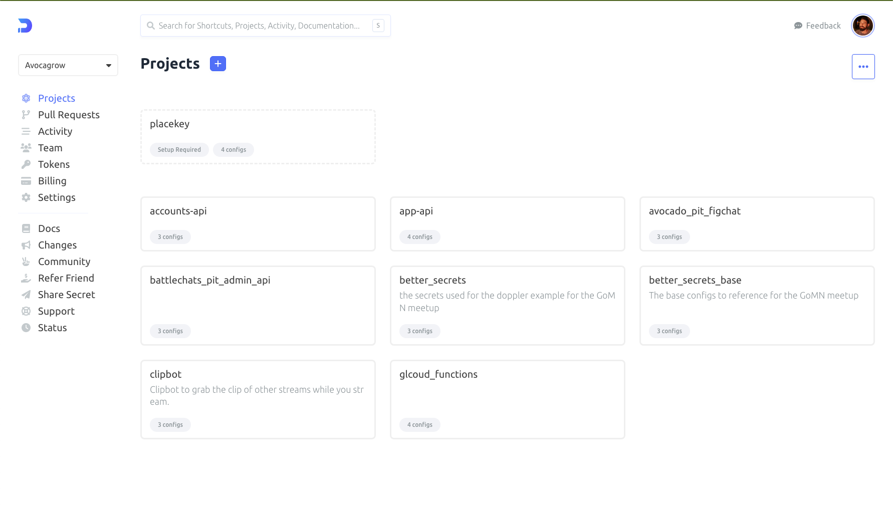

---
# try also 'default' to start simple
theme: seriph
# random image from a curated Unsplash collection by Anthony
# like them? see https://unsplash.com/collections/94734566/slidev
background: https://source.unsplash.com/collection/94734566/1920x1080
# apply any windi css classes to the current slide
class: 'text-center'
# https://sli.dev/custom/highlighters.html
highlighter: shiki
# show line numbers in code blocks
lineNumbers: false
# some information about the slides, markdown enabled
info: |
  ## Slidev Starter Template
  Presentation slides for developers.

  Learn more at [Sli.dev](https://sli.dev)
# persist drawings in exports and build
drawings:
  persist: false
# use UnoCSS
css: unocss
---

# Better Secrets and Config Management with Doppler


<div class="pt-12">
  <span @click="$slidev.nav.next" class="px-2 py-1 rounded cursor-pointer" hover="bg-white bg-opacity-10">
    Press Space for next page <carbon:arrow-right class="inline"/>
  </span>
</div>

<div class="abs-br m-6 flex gap-2">
  <button @click="$slidev.nav.openInEditor()" title="Open in Editor" class="text-xl icon-btn opacity-50 !border-none !hover:text-white">
    <carbon:edit />
  </button>
  <a href="https://github.com/slidevjs/slidev" target="_blank" alt="GitHub"
    class="text-xl icon-btn opacity-50 !border-none !hover:text-white">
    <carbon-logo-github />
  </a>
</div>

<!--
The last comment block of each slide will be treated as slide notes. It will be visible and editable in Presenter Mode along with the slide. [Read more in the docs](https://sli.dev/guide/syntax.html#notes)
-->

---

# Who am I


- 📝 **Founder** of Avocagrow, a tool for helping with your plants
- 🧑‍💻 **Senior Software Engineer** @ TSI, Inc.
- 🥑 **Random facts** : 
    - Owner of what some may consider too many plants. 
    - Lover of spicy food - the hotter the better
    - Make too many references to HBO's Silicon Valley

<br>
<br>

<span style="font-size:10px">* This talk is not sponsored by Doppler or any of the tools mentioned.</span>


<!--
You can have `style` tag in markdown to override the style for the current page.
Learn more: https://sli.dev/guide/syntax#embedded-styles
-->

<style>
h1 {
  background-color: #2B90B6;
  background-image: linear-gradient(45deg, #4EC5D4 10%, #146b8c 20%);
  background-size: 100%;
  -webkit-background-clip: text;
  -moz-background-clip: text;
  -webkit-text-fill-color: transparent;
  -moz-text-fill-color: transparent;
}

.slidev-layout {
background-color: #1b1a1d;
background-image: url("data:image/svg+xml,%3Csvg xmlns='http://www.w3.org/2000/svg' viewBox='0 0 80 40' width='80' height='40'%3E%3Cpath fill='%23252725' fill-opacity='0.4' d='M0 40a19.96 19.96 0 0 1 5.9-14.11 20.17 20.17 0 0 1 19.44-5.2A20 20 0 0 1 20.2 40H0zM65.32.75A20.02 20.02 0 0 1 40.8 25.26 20.02 20.02 0 0 1 65.32.76zM.07 0h20.1l-.08.07A20.02 20.02 0 0 1 .75 5.25 20.08 20.08 0 0 1 .07 0zm1.94 40h2.53l4.26-4.24v-9.78A17.96 17.96 0 0 0 2 40zm5.38 0h9.8a17.98 17.98 0 0 0 6.67-16.42L7.4 40zm3.43-15.42v9.17l11.62-11.59c-3.97-.5-8.08.3-11.62 2.42zm32.86-.78A18 18 0 0 0 63.85 3.63L43.68 23.8zm7.2-19.17v9.15L62.43 2.22c-3.96-.5-8.05.3-11.57 2.4zm-3.49 2.72c-4.1 4.1-5.81 9.69-5.13 15.03l6.61-6.6V6.02c-.51.41-1 .85-1.48 1.33zM17.18 0H7.42L3.64 3.78A18 18 0 0 0 17.18 0zM2.08 0c-.01.8.04 1.58.14 2.37L4.59 0H2.07z'%3E%3C/path%3E%3C/svg%3E");
}
</style>

<!--
Here is another comment.
-->
---
layout: image-right
image: https://i.redd.it/md22ub2uo6461.jpg
---
# What is a secret?
 <br />

 - Configs
 - API Keys
 - SSH Keys
 - Private TLS Certificates
 - Auth tokens

---
layout: image-left
image: https://i.redd.it/yf59lbyljzu41.jpg 
---

# How do we normally share secrets?

 - .env files committed to source control.
 - Password managers
 - Custom CLI tool to connect to Hashicorp Vault hosted in GCP
 - Ctrl+C, Ctrl+V them into Teams/Slack/IM
 - Email

<span style="font-size:10px">*This is how I've seen it done past companies</span>


---
layout: image-left
image: https://sdtimes.com/wp-content/uploads/2015/06/0601.sdt-blog-svs2e8-gilfoyle.png
---
# Pitfalls of .env files

 - Can quickly be outdated
 - Can contain sensitive information that shouldn't be stored in source control
 - Not entirely easy to share securely

<br/>

#### Not an IF, but WHEN Hackers will breach your system
 - Twitch 
 - Microsoft 
 - Samsung 
 - Many more

---
layout: image-right
image: https://source.unsplash.com/collection/94734566/1920x1080
---

# What can we use instead?

- Hashicorp Vault
- Azure Keystore
- AWS Secrets Manager
- Doppler
- Teller <span style="font-size:12px">*this one is pretty cool</span>

---

# Using Doppler

<span style="font-size:10px">
```sh
# MacOS
brew install gnupg && brew install dopplerhq/cli/doppler

# linux
(curl -Ls --tlsv1.2 --proto "=https" --retry 3 https://cli.doppler.com/install.sh || wget -t 3 -qO- https://cli.doppler.com/install.sh) | sudo sh
```
</span>

<span style="font-size:10px">[More instructions: https://docs.doppler.com/docs/install-cli](https://docs.doppler.com/docs/install-cli)</span>

<br/>
<div grid="~ cols-2 gap-2" m="-t-2">
<div>

 - CLI 
 - REST API
 - Web UI

</div>
<div>


</div>
</div>


<br/>


<!--
Presenter note with **bold**, *italic*, and ~~striked~~ text.

Also, HTML elements are valid:
<div class="flex w-full">
  <span style="flex-grow: 1;">Left content</span>
  <span>Right content</span>
</div>
-->


---
class: px-20
---

# Demo Application

<span style="font-size:.7em">

Repository: [https://github.com/theoriginalstove/doppler-example](https://github.com/theoriginalstove/doppler-example)

Demo App: [https://demo.avocagrow.com](https://demo.avocagrow.com)

</span>

<br/>

<div grid="~ cols-2 gap-2" m="-t-2">

<div>
Tools used:

 - Ngrok 
 - Go 
 - Doppler CLI

</div>
<div>
</div>

</div>
